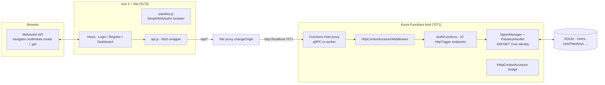
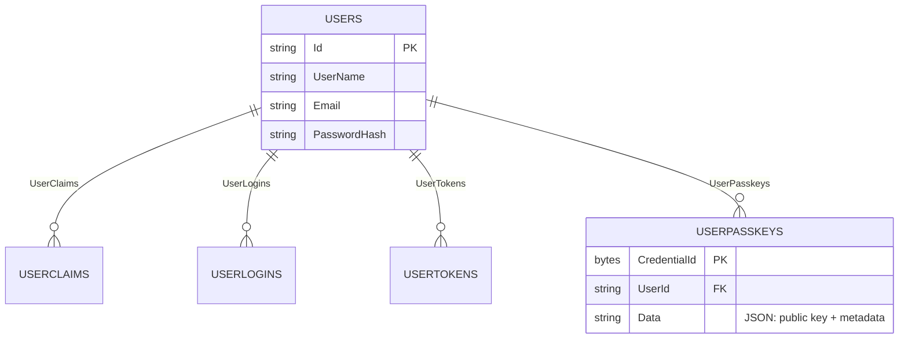

# Architecture: Functions host + ASP.NET Core Identity passkeys

This document explains the plumbing that makes the passkey flow work in an Azure Functions
isolated worker app, and why certain parts of the code exist.

## Components



## Process roles

- The **browser** runs every WebAuthn ceremony. It must see a consistent origin/domain: pages and
  API calls are both served from `http://localhost:5173`.
- **Vite** proxies `/api/*` to the Functions host. `changeOrigin` rewrites only the `Host` header;
  the browser's `Origin` header (`http://localhost:5173`) passes through unchanged, which is
  exactly what Identity compares against `clientData.origin`.
- The **Functions host** translates incoming HTTP into gRPC invocations of worker functions, and
  translates the worker's response back out. Cookies, status codes and headers round-trip.

## ASP.NET Core integration

`Program.cs` uses the ASP.NET Core integration of the worker SDK:

```csharp
var builder = FunctionsApplication.CreateBuilder(args);
builder.ConfigureFunctionsWebApplication();
```

This wires a real ASP.NET Core pipeline inside the worker (Kestrel on a loopback address). Each
`[HttpTrigger]` function becomes an ASP.NET Core endpoint, so functions can use `HttpRequest`
(ASP.NET Core type), authenticate imperatively, and return `IActionResult` (the pattern used in
`AuthFunctions.cs`). Plain `Results`/MVC JSON serialization works out of the box.

## Why `HttpContextAccessorMiddleware` exists

ASP.NET Core Identity's `SignInManager` reads its `HttpContext` from `IHttpContextAccessor`. In the
isolated worker, however, the function runs on the *gRPC invocation thread*, while the real request
lives on the *ASP.NET Core request thread* — so under default settings
`IHttpContextAccessor.HttpContext` is `null` inside a function (see
[azure-functions-dotnet-worker#2372](https://github.com/Azure/azure-functions-dotnet-worker/issues/2372)).

`backend/Functions/HttpContextAccessorMiddleware.cs` bridges the gap: it stores the real
`HttpContext` into the accessor before the function runs and clears it afterwards:

```csharp
public async Task Invoke(FunctionContext context, FunctionExecutionDelegate next)
{
    var httpContext = context.GetHttpContext();
    if (httpContext is not null)
    {
        httpContextAccessor.HttpContext = httpContext;
    }
    try { await next(context); }
    finally { httpContextAccessor.HttpContext = null; }
}
```

Everything `SignInManager` and `PasskeyHandler` do through `Context` then works unchanged:
cookie ceremonies, `Context.User`, origin checks against `HttpContext.Request.Headers.Origin`,
etc. It is registered with `builder.UseMiddleware<HttpContextAccessorMiddleware>();`.

## Authentication & cookie schemes

`Program.cs` registers cookie authentication with four schemes:

| Scheme (`IdentityConstants.*`) | Purpose |
| --- | --- |
| `ApplicationScheme` | The real session: cookie `PasskeyExample.Auth` (HttpOnly, SameSite=Lax). Written on password or passkey sign-in. |
| `ExternalScheme` | Reserved by Identity for external logins (unused here). |
| `TwoFactorRememberMeScheme` | Reserved (unused here). |
| `TwoFactorUserIdScheme` | **Passkey ceremony state** — the short-lived cookie that carries the expected challenge/origin/user between `create-options`/`login-options` and `register`/`login`. |

Because the worker integration does not support `UseAuthentication()` middleware, every protected
endpoint authenticates imperatively:

```csharp
private async Task<ClaimsPrincipal?> GetAuthenticatedPrincipalAsync(HttpContext context)
{
    var result = await context.AuthenticateAsync(IdentityConstants.ApplicationScheme);
    return result.Succeeded ? result.Principal : null;
}
```

## Key Identity calls used by the endpoints

| Endpoint | Identity call | What it does |
| --- | --- | --- |
| `POST /passkey/create-options` | `signInManager.MakePasskeyCreationOptionsAsync(passkeyUser)` | Builds `PublicKeyCredentialCreationOptions`, stores expected challenge/origin/user in the state cookie |
| `POST /passkey/register` | `signInManager.PerformPasskeyAttestationAsync(credentialJson)` + `userManager.AddOrUpdatePasskeyAsync(user, passkey)` | Validates the attestation, stores the `IdentityPasskey` |
| `POST /passkey/login-options` | `signInManager.MakePasskeyRequestOptionsAsync(user?)` | Builds `PublicKeyCredentialRequestOptions` (allowed credentials if user known), stores expected challenge/origin in the state cookie |
| `POST /passkey/login` | `signInManager.PasskeySignInAsync(credentialJson)` | Verifies the assertion, resolves the user, writes the app cookie |
| `GET /passkeys` | `userManager.GetPasskeysAsync(user)` | Lists the user's passkeys |
| `DELETE /passkeys/{id}` | `userManager.RemovePasskeyAsync(user, credentialId)` | Deletes a passkey |

## Data model



The `AspNet` prefix is stripped from all Identity table names in
`AppDbContext.OnModelCreating`; `AppDbContext` derives from `IdentityUserContext<ApplicationUser>`
(user-only model, no role tables). Roles are not used anywhere in this application.

## Configuration cheat sheet

| Setting | Where | Effect |
| --- | --- | --- |
| `IdentityPasskeyOptions.ServerDomain = "localhost"` | `Program.cs` | WebAuthn `rp.id`; must resolve to the browser origin's registrable domain |
| `DefaultConnection` | `local.settings.json` (`ConnectionStrings`) | SQLite connection string, falls back to `Data Source=passkeys.db` |
| `routePrefix: "api"` | `host.json` | Functions routes are exposed under `/api/…` |
| Vite `proxy '/api' -> http://localhost:7071` | `frontend/vite.config.js` | Keeps browser origin at `:5173` so origin validation & cookies line up |