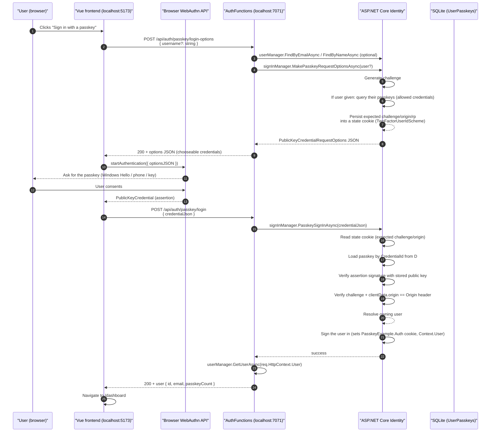

# Passkey Authentication (signing in with a passkey)

"Authentication" here means signing in to a new session with an already-registered passkey.
It runs in the Login view. Unlike registration, no session cookie is required up front — the
passkey itself is the proof of identity.

## Sequence



## Step by step

### 1. Server prepares request options

`backend/Functions/AuthFunctions.cs` — `PasskeyLoginOptions` accepts an optional `username`:

```csharp
ApplicationUser? user = null;
if (!string.IsNullOrWhiteSpace(request?.Username))
{
    user = await userManager.FindByEmailAsync(request.Username);
    user ??= await userManager.FindByNameAsync(request.Username);
}
var optionsJson = await signInManager.MakePasskeyRequestOptionsAsync(user);
```

- A random **challenge** is generated.
- If a user was resolved, their registered passkeys become the **allowed credentials**
  (`allowCredentials`), so the browser offers only the matching authenticator. If no username was
  supplied, discovery is "discoverable credentials only" (resident keys), which lets the ceremony
  begin with no username.
- As in registration, the expected **challenge / origin / rp** are stored in a temporary state
  cookie (`IdentityConstants.TwoFactorUserIdScheme`).

The `PublicKeyCredentialRequestOptions` JSON is returned verbatim.

### 2. Browser runs the WebAuthn assertion

`frontend/src/passkey.js`:

```js
const assertion = await startAuthentication({ optionsJSON: options })
return authApi.passkeyLogin(JSON.stringify(assertion))
```

`@simplewebauthn/browser` calls `navigator.credentials.get()`. The returned `PublicKeyCredential`
(assertion) contains the `rawId`, `clientDataJSON`, and `authenticatorData` + `signature`.

### 3. Server verifies and establishes the session

`backend/Functions/AuthFunctions.cs` — `PasskeyLogin` calls
`signInManager.PasskeySignInAsync(credentialJson)`, which:

1. parses the assertion,
2. reads the **state cookie** from step 1 and verifies the **challenge**,
3. verifies `clientData.origin` equals the HTTP `Origin` header,
4. loads the passkey row by `CredentialId` from `UserPasskeys`,
5. verifies the assertion **signature** against the stored public key (Fido2NetLib),
6. resolves the owning user and signs them in:
   `SignInOrTwoFactorAsync(user, …, bypassTwoFactor: true)` → sets `Context.User` and writes the
   **application cookie** (`PasskeyExample.Auth`, HttpOnly) via the `ApplicationScheme` handler.

The endpoint then returns the user profile (`id`, `email`, `passkeyCount`), and the frontend
redirects to `/dashboard`. Every later authenticated call (`/api/auth/me`,
`/api/auth/passkeys`, `/api/auth/passkey/create-options`, …) only needs that cookie.

### 4. Failures

- Unknown credential id or bad signature → `401`.
- Account locked out (too many failed attempts) → `403` with `{ message: "Account is locked out." }`.
- Missing/invalid `credentialJson` → `400`.

## Why the state cookie is required

The server must tie the assertion to the specific ceremony it started (replay protection) and to the
origin it authorized. ASP.NET Core Identity stores that contract in the short-lived
`TwoFactorUserIdScheme` cookie between the login-options call and the login call. This is the same
mechanism the middleware bridges in the isolated worker — see
[architecture.md](architecture.md).