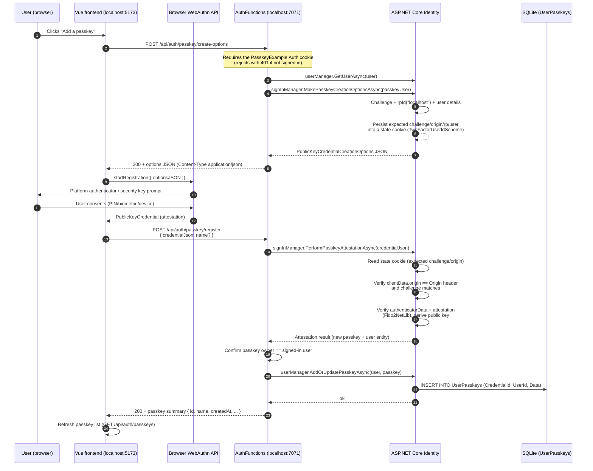

# Passkey Registration (adding a passkey)

"Registration" here means: an *already signed-in* user attaches a new WebAuthn credential
(a passkey) to their account. It runs in the Dashboard view.

## Sequence



## Step by step

### 1. Server creates registration options

`backend/Functions/AuthFunctions.cs` — `PasskeyCreateOptions`:

```csharp
var optionsJson = await signInManager.MakePasskeyCreationOptionsAsync(new PasskeyUserEntity
{
    Id = userId,
    Name = userName,
    DisplayName = userName
});
```

The endpoint authenticates the caller first (via the `PasskeyExample.Auth` cookie); unauthenticated
requests get `401`. Then Identity builds the ceremony options:

- a random **challenge**,
- **relying party** `{ name: "localhost", id: "localhost" }` — the `id` comes from
  `IdentityPasskeyOptions.ServerDomain` (`Program.cs`),
- the **user** handle/name/displayName from the current account,
- `pubKeyCredParams`, `authenticatorSelection` (`residentKey: preferred`,
  `userVerification: required`), etc.

The raw JSON is returned verbatim with `Content-Type: application/json`
(a `ContentResult`), so the browser gets modern `PublicKeyCredentialCreationOptions` JSON.

**State cookie.** Identity stores the expected ceremony state — the challenge, relying-party id and
origin it issued, and the owning user — in a temporary cookie using the
`IdentityConstants.TwoFactorUserIdScheme` scheme. It is read back when the attestation arrives.

### 2. Browser runs the WebAuthn ceremony

`frontend/src/passkey.js`:

```js
const attestation = await startRegistration({ optionsJSON: options })
return authApi.passkeyRegister(JSON.stringify(attestation), name)
```

`@simplewebauthn/browser` calls `navigator.credentials.create()` internally. The browser shows the
system prompt (Windows Hello, phone, security key…) and returns a `PublicKeyCredential`; the
frontend serializes it to JSON and sends it to the server.

### 3. Server validates and stores the credential

`backend/Functions/AuthFunctions.cs` — `PasskeyRegister` calls
`signInManager.PerformPasskeyAttestationAsync(credentialJson)`, which:

1. parses the `PublicKeyCredential` (client data JSON, authenticator data, attestation, signatures),
2. reads the **state cookie** from step 1,
3. verifies the **challenge** matches the one it issued,
4. verifies **origin**: `clientData.origin` must equal the HTTP `Origin` header
   (both are `http://localhost:5173` through the Vite proxy),
5. verifies the **authenticator data / attestation** and extracts the credential's **public key**,
6. returns the resulting `IdentityPasskey` (`CredentialId`, `UserId`, serialized `Data`) plus the
   user the ceremony was started for.

The function then:

- rejects if the passkey's owner is not the currently signed-in user,
- assigns the friendly name (`request.Name` or `"Passkey"`),
- persists the credential via `userManager.AddOrUpdatePasskeyAsync(user, passkey)`.

### 4. Database

One row is written to the `UserPasskeys` table:

| Column | Content |
| --- | --- |
| `CredentialId` | The credential id produced by the authenticator (up to 1023 bytes) |
| `UserId` | FK to `Users.Id` (cascade delete) |
| `Data` | JSON blob (the FIDO public key + registration metadata) |

## Later ceremonies

Passkeys created here are listed on the dashboard (`GET /api/auth/passkeys`) and used for
authentication — see [passkey-authentication.md](passkey-authentication.md). They can be removed
individually (`DELETE /api/auth/passkeys/{credentialId}`, base64url encoded).